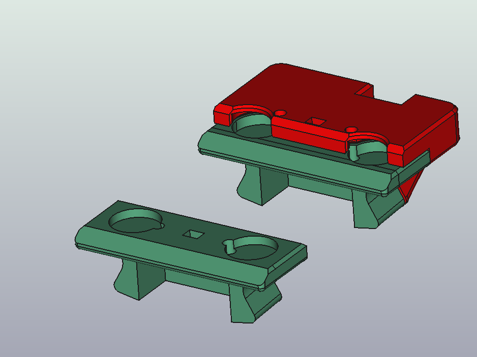

# KlickyNG_probe_mod
Small suggestions to improve klickyNG probe CAD

Author of the original project
Original is here : https://github.com/jlas1/Klicky-Probe/tree/main/Probes/KlickyNG
Instructions, configuration, macros will be found in the above repository

If you want to support his project and efforts, [buy him some coffee](https://www.buymeacoffee.com/JosAr)

KlickyNG probe is in Beta and satisfies me but I think it could be improved.

## From Klicky Probe to KlickyNG Probe

I came to KlickyNG while I experienced loosing magnets on my Klicky. I do like much the new concept but i encoutered problem to align the probe to the Heat bed 

## The Probe itself
Original Parts are really small and not optimize to reach FDM printer standards settings. Here is my attempt to calibrate parts for the slicer settings below.

### Slicer settings
(same as Voron specs)
- Layer heigth : 0.2mm
- Line width : 0.4mm
- Wall count : 4
- Top/Bottom height : 1mm
- Infill density : 40%

### Materials
only ABS

### Modified parts
- KlickyNG_probe_body : 
   * Make consistent print part by calibrate wall width and thickness with regard to slicer settings
   * Original one makes inclined plane , reduce it by increasing thickness of flat plane, 0.8mm(4 layers) instead of 0.65mm
   * Add holes to easyly remove magnets (in case of next gen 2)
   * Add slots to help alignement (no consequenses on dock_probe)
- KlickyNG_probe_insert_2.75mm and KlickyNG_probe_insert_3mm : 
   * Increase depth for magnet by 0.1mm to reduce gap between insert and body
   * ~~remove slope of microswitch holder (less then 1 layer) does not make any difference~~

## The toolhead mount

Nothing done for now

### To do/try
- reduce front magnet holder to get the probe closer. 
- Replace the back magnet by a screw (eg. M3x8 SHCS) to give some adjsutment... 
